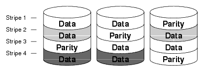
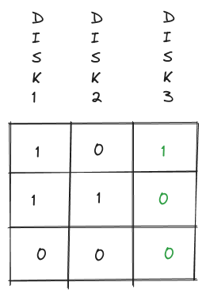
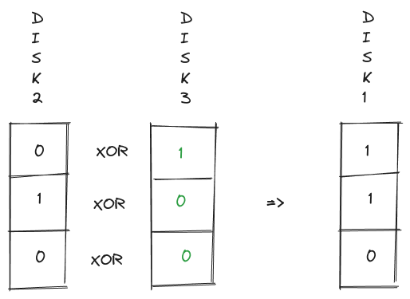

### Data-intensive vs compute-intensive applications

The CPU is usually not a limiting factor for data-intensive apllications, the amount and complexity of data usually is.

A data intensive application usually uses standard building blocks such as databases, caches, search indexes, stream processors and batch processors.

### The book focuses on three concerns that are important in most software systems

#### Reliability

The system continues to work performing the correct function at the desired level of performance when hardware faults, software faults and human error happen.

#### Scalability

There should be reasonable ways for the system to deal with growth as the data, trafic vollume or complexity grows.

#### Maintainability

People should be able to change the system productively.

#### Difference between fault and failure

A fault is usually defined as one component of the system deviating from its spec.

A feailure iswhen the system as a whole stops providing the required service.

One technique that can be used to help us build fault-tolerant systems is using chaos testing to find faults that were not accounted for.

#### Hardware faults

Hardware fails all the time when you have a lot of machines. Example: [Jeff Dean: Building software systems at Google](https://static.googleusercontent.com/media/research.google.com/en//people/jeff/Stanford-DL-Nov-2010.pdf) page 57

As applications' computing demands have increased, applications have begun using larger number of machines which increases the rate of hardware faults. Because of that there's a move toward systems fault-tolerant systems that can tolerate the loss of entire machines.

##### Reducing disk failure rate with RAID

Example: Using RAID to avoid data loss.  
[What is RAID 0, 1, 5, & 10?](https://www.youtube.com/watch?v=U-OCdTeZLac)  
[How does RAID and RAID Parity work?](https://www.youtube.com/watch?v=2Dovoc9LP34)  
[Raid 5 with parity](https://sort.veritas.com/public/documents/sf/5.0/linux/html/vxvm_admin/ag_ch_intro_vm17.html)  

How XOR parity works:

#### Software errors

The author mentions several types of software errors and also mentions that some errors take a long time to be found. 

Example: [glibc qsort out of bounds read and write](https://www.openwall.com/lists/oss-security/2024/01/30/7) - 

Takeaways: 
- Design systems that minimize opportunities for human error.
- Make it easy to recover from human errors.
- Test the system.
- Monitor the system.

#### How important is reliability?

Reliability importance depends on the system. For example. some system have SLAs which means the company could lose money if the system is not reliable enough.

#### Maintainability

- One way to make a system simpler is to avoid/remove accidental complexity. 
- Abstraction is a tool that can be used to hide complexity behind simpler interfaces.